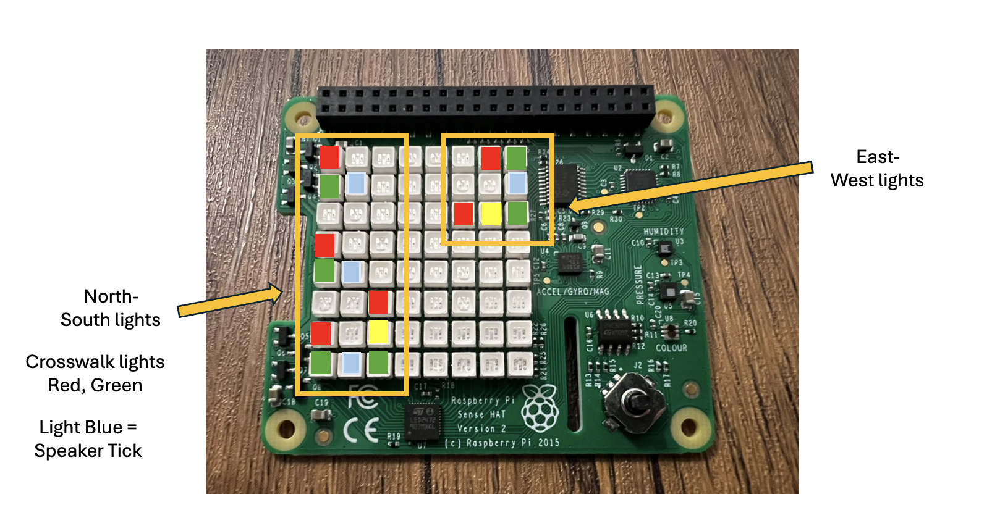
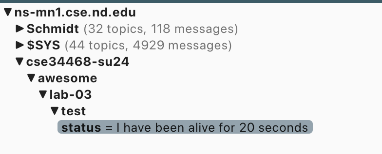

# Lab 3 - Smart German Stoplight

| **Aspect** | **Information** |
| --- | --- | 
| **Assigned** | Monday, June 3rd - Block 2 | 
| **Due** | Monday, June 10th - 5 PM (two class periods to work on it) | 
| **Team** | May be done in a group of up to three |  
| **Canvas Link** | [Lab 03](https://canvas.nd.edu/courses/92659/assignments/275049) | 
| **Points** | 45 points | 

## Overview

For Lab 3, we will be implementing a controller for a German stoplight along with the accompanying cross-walk identifier. This will be the first of two multi-day labs where it is not expected that you finish the entirety of the lab in one individual session.  This will also be the first lab where you can work as a group which can both allow for better code but at times can also be frustrating and more time consuming as you learn to operate as a group. 

There are two parts to the lab:

* **Stoplight Control:** For this part, you will be constructing a Finite State Machine and then iterating through the various states of the two primary directions for traffic flow as well as the respective crosswalks. You will also mimic the chirp of the speaker. 

* **Smart Information:** For this part, you will be sharing the state of your stoplight as a JSON to a MQTT server housed at Notre Dame. The communication will be one-way from your stoplight to the MQTT server but you will be able to verify that it is working by bringing up a MQTT app allowing you to see the states of the various channels / topics that your stoplight controller will be populating. You will also reflect as a group on what such smart information might enable. 

## Working as a Group - Sharing Collaborative Access

If you are working individually, you do not need do anything but you should read the following material about how `git` works.

Since you have the option of working as a group, it will be important to share access to your respective repositories with each other.  This does not need to be done all at once but it is probably a good idea to do this early on. 

In a typical software project, a project can have multiple developers.  The tool that we are using, `git`, allows multiple users to collaborate on the same project.  Each developer has a local copy of the code that they are working on and can `commit` various incremental changes locally until things are ready to be shared with the broader team via `push`.  In fact, `git` has a special mechanism called a `branch` that allows you to split off a copy of the code that you are working on. This is different than a `fork` where you make a copy of a public repository to modify / update on your own. The `branch` operation though is a bit tricky and generally involve the usage of a `merge` to bring the temporary `branch` back into the `main` or default branch.  For now, just know that something called a `branch` exists and for our purposes, we will **not** be using them.

For software projects, there is also usually a fairly large body of code allowing different developers to potentially work on different files.  Since we are focusing on learning functionality rather than all of the minutia of Python and broader software projects and are working on embedded systems which tend to be simpler / smaller, many of the benefits of `git` tend to disappear.  However, it makes life way easier for your instructor when it comes to grading.

To make sure that everyone in your team has access to the code for the lab, you will need to add your team members as a collaborator to your private repository, much like you did with Prof. Striegel in the pre-assignment.  Note that this means that you can see everything in the repository (including homework) so the Honor Policy will apply in terms of staying to the directories that matter.  

### Share Collaborative Access

**Task:** Get the GitHub IDs from your group members and each other to your respective private class repositories. 

### Note on Teaming

Teaming when done well with programming can be fantastic.  There is ample literature that projects when done in a pair programming approach (one person driving, one person watching), code turns out better and is less prone to errors.  

When you are teaming, only one member needs to submit their hash via Canvas.  To allow for more flexibility on teams for the labs, teams will not be explicitly created in Canvas except for the final project.  Make sure that your source code files explicitly identify who is on the team as well as the accompanying `README.md` file in the lab submission directory. 

However, we do want to avoid a situation where one person (probably someone in CS) ends up driving the development across the entire summer.  Thus, there is only one restriction when it comes to teaming, everyone on the team must do a submission from their repository before anyone is allowed to repeat.  If you end up switching teams between labs, pick the person with the least number of "submissions."  The person who is doing the submission should be the "driver" with source code editing being done primarily on their laptop.  The running of the code can be done by anyone on the team.  

Also, if you are working on a team, please use the `group` sub-directory and select an appropriate team identifier to use for placing your files on the respective Raspberry Pi nodes.

## Part 1 - Controlling the Stoplight

As noted earlier, we will be implementing a controller for a German stoplight along with the accompanying cross-walk identifier. The German stoplights are a bit interesting in that instead of the normal green, yellow, red sequence, there is an added red / yellow combo before the light turns green.  For the purpose of this lab, we will be controlling the lights across two of the directions in a four-way intersection that contains a tram crossing as well (staggered walk light timings), north-bound and west-bound.  We can assume that the other directions would effectively be mirrored.  

In addition to controlling the stoplight, we will be using a message broker protocol called [MQTT](https://mqtt.org) to convey the current state of the stoplight connecting up to a server housed at Notre Dame.  Using that server, we will be able to observe the state of the stoplight both through the state of the lights (LED output) as well as through an app on your laptop or smartphone whereby you will be sharing the state of your stoplight.  It will be left as an exercise for your creativity as to how such centrally shared information might be useful in say an ecosystem or other smart technologies.  

## Setup

For our stoplight, we will be using the 8x8 LED matrix of the Raspberry Pi Sense HAT.  The following is a diagram of how the LEDs should be used.  

### README.md

For most software projects, a file named `README.md` is created that contains all of the relevant information.  Inside of your `lab-03` directory underneath the `hw` directory, place the relevant information about your lab.  You should identify all group members, who is the lead (laptop where the coding is going on), and also list the GitHub usernames as well as e-mail addresses for everyone in your group.  

**Note:** If you are working individually, you should still create a `README.md` file with only your own information.

**Task:** Once added, `commit` your file to your local repository starting your message with a prefix of `lab-03`.  It is entirely optional if you want to push the change at this point. 

### Sense HAT Functionality

For the pre-assignment and for Lab 1, we defined the state of all of the LED lights.  However, that can be a bit tricky to write out all of the respective LEDs and to track things.  Fortunately, there are additional functions that we can use if we want to control only a single stoplight.

```
from sense_hat import SenseHat

sense = SenseHat()

sense.set_pixel(2, 2, (0, 0, 255))
```

This code will work both on the Raspberry Pi itself as well on the trinket.io emulator where you initially tested your code in the pre-assignment.  Copy and paste the code into trinket.io (instead of the existing code) and try out the code.  Is the first parameter the row?  Or the column? Could you hover over the `set_pixel` code to get more information in Visual Studio? What about on the trinket.io emulator site?  Adjust the RGB values until you feel happy with a solid red, yellow, and green color.  

### State Machine

If we think about the operation of the stop light, it can be thought of as what is known as a [Finite State Machine or FSM](https://en.wikipedia.org/wiki/Finite-state_machine). In the pre-assignment, the code that rotated through images could also be thought of as a FSM, with each rotation through the loop, the image was changed amongst the group of images.  The selected image could be thought of as a state and by use of the modulus function, the image can wrap around to the next one and repeat the loop until the code is finally exited via either stop or Control-C.  

For this lab, we are going to take a somewhat similar approach where will have a base timer as part of our loop that will essentially be a `while` forever loop with a 250 ms sleep.  Each execution of the loop will examine which state the system is in and then will appropriately update the lights. You can take a look at a preview of the basic skeleton for the code in `stoplight.py`.

With your group members, plan out writing in comments what an appropriate set of states might be.  Give each state a name (string) and consider what the setting of the lights should be at each point.  Consider the following constraints:

* The main stoplight for the traffic should follow the pattern of red, red-yellow, green, yellow.    
* The main stoplights for the different directions should never be green at the same time.
* The crosswalk lights should follow the flow of traffic, e.g. pedestrians should not be crossing when traffic is allowed.
* For the north-south crosswalk, pedestrian traffic will have three walk / do not walk sets of lights, one for traversing the sidewalk to the middle, one for traversing the middle over the tram tracks, and one for going from the tram median to the other sidewalk. 
   * Recall that on transitioning to green, generally all of the crosswalk lights on the direction turn green and then stagger to red.  
* For the east-west crosswalk, there is only a single walk / do not walk light as there is not a middle portion to traverse.
* For mimicking the tick of the speaker, we will flash a light light on and off associated with that direction (250 ms on, 750 ms off).
   * There are three speakers in the north-south direction and one speaker in the east-west direction.



Think about what sort of timing each light should have. How long should the main traffic light be green for a given direction?  How much time does that give for the crosswalk? What are the different states where you might enumerate the overall system?  Try walking across part of the classroom for what you think is an appropriate distance, how long does that take?  Think as well about waiting, recognizing the light has changed and starting to walk across in your timing consideration.

For instance, you might say that the main traffic light should have 30 seconds. When the main traffic light is green, that means that the crosswalk in parallel should be green for 20 or 25 of those 30 seconds.  You might view that as a state with something like the following information:

* `NS-GoWalk-EW-Stop` happens when the traffic starts to go in the N-S direction.  The cross-walk going N-S is on.  This state lasts for 20 seconds.  In this state, the N-S stoplight is green and the crosswalk is green.  The next state is `NS-GoDontWalk-EW-Stop` and that transition happens after 20 * 4 ticks. The N-S speaker should also be chirping.
* `NS-GoDontWalk-EW-Stop` means that traffic is flowing but the crosswalk has shifted to red to signify that time is running short. The N-S speaker should not be chirping. This should last for 10 seconds and a transition should happen at 10 * 4 ticks.  The next state is ...

Sketch out all of the various states for the stoplight and write it down in either comments in your source code file or in your `README.md`.

### Write the Helper Functions

Think about what sort of a strategy that you might want to use for controlling the various lights of the stoplight.  Do you want to have your function recognize the state and then set the various pixels or would you rather have your main loop call a function telling it what to set the light values to.  

For instance, keying off of the state:

```
def setStoplight_NS (SenseHAT, State):
  if State == 'NS-GoWalk-EW-Stop':
    SenseHAT.set_pixel(0, 0, (255, 0, 0))
  elif:
    ...
```

or having the main body of the code do the work (**this way is recommended**):

```
def setStoplight_NS (SenseHAT, Setting):
  if Setting == 'Red':
     SenseHAT.set_pixel(0, 0, (255, 0, 0)) 
  elif Setting == 'Red-Yellow':
     ...
```

Note that for your functions, you will need to pass in the SenseHAT class instance in order to be able to manipulate the Sense HAT board. You can see an example in the `stoplight.py` file.  

Go ahead and get started.  Think about how your states work.  Think about how you split your code into functions.  Think about how the chirp of the speaker relates to the broader states.  Tinker, plan, and try it out.  

To help make things faster when testing, you can adjust the pre-scalar value. The pre-scalar is a divider applied to the timing that makes thing faster or slower.  As it is currently set up, the clock runs twice as fast.  Adjust it appropriately to make your code a bit easier to test. 

### Iterate on Your Code

Test your code using the [SenseHAT emulator](https://trinket.io/sense-hat).  Once you are sure that it is working, test your code on a real Raspberry Pi.  Use the Lab 1 writeup for the information about the respective IP addresses.  We will plan on having the six Raspberry Pi 5's fully operational with an option to turn on the two additional Rasbperry Pi 2W Zero nodes.

**Task:** Demonstrate your stoplight working on the Raspberry Pi to Prof. Striegel.

## Part 2 - Making the Stoplight Smart

While in the first part we worked on controlling the stoplight, in the second part, we are seeking to share the state of the stoplight for the purposes of connecting the information therein to a broader ecosystem allowing others to build on such information. In the spirit of the Field of Dreams, the hope is that by putting the information out there (if you build it), entrepneurial individuals will build fascinating / cool apps to take advantage of such information (they will come).  Of course the question of who pays to host such servers and then to provide the data to all of those entpreneurs is a question that we will ignore and leave to a subsequent funding cycle.

### Overview - Part 2

For the purposes of making our stoplight "smart" (e.g. sharing information), we will be using a protocol called MQTT.  One can informally think of MQTT as Discord for the Internet of Things or to date oneself a bit, Instant Messenger for IoT.  As MQTT is done across the network, we will no longer be able to use the Sense HAT emulator and will need to transition to only the Raspberry Pi units themselves.  

MQTT (Message Queuing Telemetry Transport) is a message-based protocol whereby messages can be published to a particular channel or topic.  When a message is published, all subscribes who are listening to that channel will receive the message.  A channel can be any appropriate string with the ability to support a hierarchical arrangement similar to how directories are listed.  You can find a reasonably good overview of MQTT [here](https://www.opc-router.com/what-is-mqtt/):

For the purposes of this class, we will be using the following location:

`cse34468-su24/YOURGROUP/xxx` where `YOURGROUP` is the identifier that you have picked for your group and `xxx` is the topic name where you are placing your messages.

### Ensure MQTT is Installed on the Pi

You can confirm if the MQTT client is installed by running:

```
pip install paho-mqtt
```

### Get a MQTT App / Confirm Operation

You can search for a variety of MQTT clients (not servers) that can be run on either your laptop or your phone.  Our MQTT server will be located at the same location as the original web server, namely `ns-mn1.cse.nd.edu`.  The username / login and port information will be provided in class.

Confirm that you can connect to the server.  You should not see your channel (yet) as we have not published anything there.  You can however see a wide variety of channels for one of Prof. Striegel's research project.  Take a look amongst the various channels briefly.

* Mac OS X and Windows: [MQTT Explorer](http://mqtt-explorer.com)

You can find the hostname, port, username, and password in the mqtt-config.json file.  



### Getting Your Client Started

Take a look at the following code: [Example MQTT Code](https://github.com/adstriegel/sigcap-buddy/blob/main/rpi_pub.py)

This code is what forms the basis for a MQTT heartbeat / information updates the aforementioned research project of Prof. Striegel.  A bit overly complicated but you can see where code can quickly expand and you can also browse some production code for our project. 

For our purposes, we are going to work with something much simpler.  Do the following:

1. Grab the `mqtt_link.py` file from the class repository
2. Grab the `mqtt_test.py` file from the class repository
3. Get the `.gitignore` file from the class repository.
4. Go to Canvas and grab the `mqtt-config.json` file from the in Files and `labs` folder.  Note that the file starts with a `.` to keep it "hidden"
5. Modify the `mqtt_test.py` file to use your group name instead of `awesome`.  If you are working individually, use your Net ID.  
6. Copy all of those files up to your Raspberry Pi that you are working on
7. Run the code
8. Browse to the code using the MQTT app that you downloaded in the past step.  See if your messages are coming through.

### Varying the Test Code

We are now going to modify the code slightly to post not just one but three messages. Add in a second message whereby you write to a topic named `time-alive` instead of `status` with only the string representation of `TheCount`. It should basically send `1`, then `2`, then `3`, etc.

Make sure that is working.

Next, create a list outside of the loop that contains the Net IDs of all of your group members. If you are working individually, create a list with your Net ID and Prof. Striegel's Net ID (striegel). Set up the loop so that it outputs a JSON that contains a name / value pair with the following information:

```
{ 'NetID' : 'striegel', 'TimeAlive' : 2 }
```

where the `NetID` value rotates and the `TimeAlive` value is drawn from the `TheCount` variable.  Output this JSON to a channel that ends in `json` replacing `status` with `json`.

Confirm that this code works correctly via MQTT-Explorer and then move onto bringing all of your code together.

### Make the Stoplight Smart

Bring over the key parts of the code from `mqtttest.py`.  The following lines from `mqtttest.py` will need to be brought over:

* The `import` of the `mqtt_link` file
   * This should go by your other `import` line(s)
* The client initialization line: `theClient = mqttnd.connect_mqtt()`
   * This should go just before your while loop

Add in support to your loop that provides the following at the following topic locations (`cse34468-su24/yourgroupname/lab-03/stoplight/`):

* A summary JSON to the `json` topic that contains all of the relevant state for the stoplight 
* The state of the North / South stoplight on the `traffic-ns` channel (e.g. Green, Red, etc.)  
* The state of the East / West stoplight on the `traffic-ew` channel (e.g. Green, Red, etc.)  

It is optional if you would like to also include the state of the crosswalks using a naming convention of your choice.  

**Task:** Demonstrate everything working together to Prof. Striegel.

## Reflection - Using the Information

In a file named `broader-use.md`, work with your group to reflect on how such information might be used.  Could the information be fused with other sources? How could that be useful to an individual? How could it be useful to the city? Could it be useful to a company? Describe a use case whereby such information could be leveraged.

Next, consider if the communication were to be made two ways and an authorized party could adjust the stoplight duration (e.g. your controller listens to messages and adjusts the durations). What might that enable? What risks might that introduce?

## End Result

Your GitHub submission will have several files in the `hw/lab-03` sub-directory for one of the group members. Your code must have the following files to receive credit for the demos in the repository of the primary submitter:

* `/hw/lab-03/stoplight.py`
* `/hw/lab-03/mqtt_test.py`
* `/hw/lab-03/broader-use.md`

If you are not submitting for your repository but are part of a different team, submit on Canvas the name of the person who is submitting for your group.

## Grading

The lab is worth a total of 45 points as described below:

* 20 pts - Successful stoplight demonstration to Prof. Striegel at either 1x or 2x speed
* 12 pts - Demonstration of MQTT information via app on phone or laptop
* 1 pt - Files are in the `lab-03` folder in your repository
* 1 pt - Files are named correctly
* 2 pt - Commit messages start with `lab-03`
   * This will be strictly enforced now.  At worst case, at a line to your code and then add in an additional comment.  
* 1 pt - Correct hash submitted via Canvas or identification of group member name
* 3 pts - Code is reasonably commented and formatted with appropriate variable names
* 5 pts - Reflect / consider advanced uses of the stoplight information

The lab is due by Monday afternoon on June 10th at 5 PM. 

